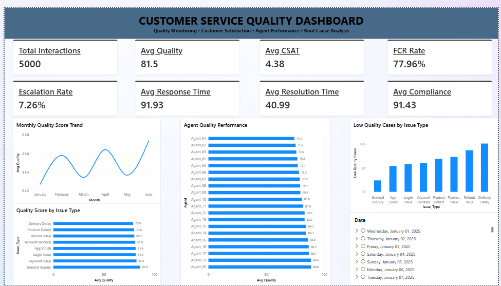

# 📊 Customer Service Quality Analysis Dashboard

An end-to-end **Customer Service Quality Analysis** project built to
analyze customer-service interactions, monitor quality KPIs, evaluate
agent performance, identify low-quality interaction patterns, and
support root-cause analysis.

The project uses **Python, SQL, Excel, and Power BI** to demonstrate a
complete data-analysis and reporting workflow.

> **Dataset note:** The dataset used in this project is synthetic and
> was created for portfolio practice. It does not contain real company
> or customer data.

## 📌 Dashboard Preview



## 🎯 Project Objective

The objective is to build a business-oriented quality monitoring
dashboard that helps answer:

-   How many customer interactions were handled?
-   What is the overall quality score?
-   How satisfied are customers?
-   What percentage of interactions are resolved on the first contact?
-   What is the escalation rate?
-   Which agents have the highest/lowest quality scores?
-   Which issue types are associated with lower quality?
-   Which issue categories contribute most to low-quality interactions?
-   How does quality change over time?

## 🛠️ Tech Stack

  Technology           Purpose
  -------------------- ----------------------------------------------------
  **Python**           Data validation, analysis and exploratory analysis
  **SQL / MySQL**      Data querying, KPI analysis and aggregation
  **Excel**            Data analysis and reporting
  **Power BI**         Interactive dashboard and visualization
  **Pandas / NumPy**   Data manipulation and analysis
  **Git / GitHub**     Version control and documentation

## 📂 Project Structure

``` text
Customer-Service-Quality-Analysis/
│
├── data/
│   └── customer_service_interactions.csv
├── sql/
│   └── analysis_queries.sql
├── python/
│   └── analysis.py
├── excel/
│   └── Customer_Service_Quality_Dashboard.xlsx
├── powerbi/
│   └── Customer_Service_Quality_Dashboard.pbix
├── dashboard.png
└── README.md
```

## 📊 Dataset

The project contains **5,000 synthetic customer-service interactions**
covering January--June 2025.

### Main columns

-   `Interaction_ID`
-   `Date`
-   `Agent`
-   `Issue_Type`
-   `Priority`
-   `Channel`
-   `Response_Time_Minutes`
-   `Resolution_Time_Hours`
-   `Resolution_Status`
-   `FCR`
-   `Escalated`
-   `Quality_Score`
-   `CSAT`
-   `Compliance_Score`

## 📈 Key KPIs

  KPI                                 Value
  ------------------------- ---------------
  Total Interactions              **5,000**
  Average Quality Score            **81.5**
  Average CSAT                 **4.38 / 5**
  FCR Rate                       **77.96%**
  Escalation Rate                 **7.26%**
  Average Response Time       **91.93 min**
  Average Resolution Time     **40.99 hrs**
  Average Compliance             **91.43%**

These values are based on the synthetic dataset used for this project.

## 📊 Power BI Dashboard

### KPI Monitoring

The dashboard monitors:

-   Total interactions
-   Average quality
-   Customer satisfaction
-   First Contact Resolution
-   Escalation rate
-   Average response time
-   Average resolution time
-   Compliance

### Monthly Quality Trend

Tracks average quality score over time to identify changes in service
quality.

### Agent Quality Performance

Compares agent-level quality scores to identify performance differences.

### Quality by Issue Type

Ranks issue categories by average quality score to identify areas
associated with lower service quality.

### Low-Quality Interaction Analysis

Analyzes interactions with a quality score below **70** by issue type to
support root-cause and process-improvement analysis.

### Interactive Filtering

The dashboard can be filtered by:

-   Date
-   Agent
-   Issue Type
-   Priority
-   Channel

## 🧮 Key DAX Measures

### Total Interactions

``` dax
Total Interactions =
COUNTROWS(Raw_Data)
```

### Average Quality

``` dax
Avg Quality =
AVERAGE(Raw_Data[Quality_Score])
```

### Average CSAT

``` dax
Avg CSAT =
AVERAGE(Raw_Data[CSAT])
```

### FCR Rate

``` dax
FCR Rate =
DIVIDE(
    CALCULATE(
        COUNTROWS(Raw_Data),
        Raw_Data[FCR] = "Yes"
    ),
    [Total Interactions]
)
```

### Escalation Rate

``` dax
Escalation Rate =
DIVIDE(
    CALCULATE(
        COUNTROWS(Raw_Data),
        Raw_Data[Escalated] = "Yes"
    ),
    [Total Interactions]
)
```

### Low Quality Cases

``` dax
Low Quality Cases =
CALCULATE(
    COUNTROWS(Raw_Data),
    Raw_Data[Quality_Score] < 70
)
```

## 🔍 Analysis Workflow

``` text
Raw Customer-Service Data
          ↓
Data Validation & Cleaning
          ↓
Python Exploratory Analysis
          ↓
SQL KPI & Performance Analysis
          ↓
Quality / Issue Analysis
          ↓
Root-Cause & Low-Quality Analysis
          ↓
Power BI Dashboard
          ↓
Business Insights & Reporting
```

## 💡 Business Questions Addressed

1.  What is the overall service quality?
2.  Are customers satisfied with the service?
3.  How frequently are issues resolved during the first interaction?
4.  How often are interactions escalated?
5.  Which agents show stronger or weaker quality performance?
6.  Which issue categories have lower quality scores?
7.  Which issue categories generate the most low-quality interactions?
8.  Is service quality improving or declining over time?
9.  Where should process-improvement efforts be focused?

## 🚀 How to Run

### Clone the repository

``` bash
git clone https://github.com/<your-username>/Customer-Service-Quality-Analysis.git
cd Customer-Service-Quality-Analysis
```

### Python

``` bash
pip install pandas numpy matplotlib
python python/analysis.py
```

### SQL

Create the database:

``` sql
CREATE DATABASE customer_quality;
USE customer_quality;
```

Import the CSV into:

``` text
customer_interactions
```

Then run:

``` text
sql/analysis_queries.sql
```

### Power BI

Open:

``` text
powerbi/Customer_Service_Quality_Dashboard.pbix
```

## 📌 Skills Demonstrated

-   Data Cleaning & Validation
-   SQL / MySQL
-   Python
-   Pandas / NumPy
-   Exploratory Data Analysis
-   KPI Development
-   Quality Analysis
-   Customer Satisfaction Analysis
-   Agent Performance Analysis
-   Root-Cause Analysis
-   Pareto Analysis
-   Trend Analysis
-   Power BI
-   Dashboard Development
-   Business Reporting

## 👨‍💻 Author

**Abdul Momin Siddiqui**

B.Tech --- Electronics & Communication Engineering\
Indian Institute of Information Technology, Ranchi

-   LinkedIn: [`/in/abdul-momin-siddiqui](https://www.linkedin.com/in/abdul-momin-siddiqui-903147225/)`
-   GitHub: `SIDMINUL`

## ⚠️ Disclaimer

This project is intended for educational and portfolio purposes. The
customer-service dataset is **synthetic** and should not be interpreted
as real customer, employee, or company data.
