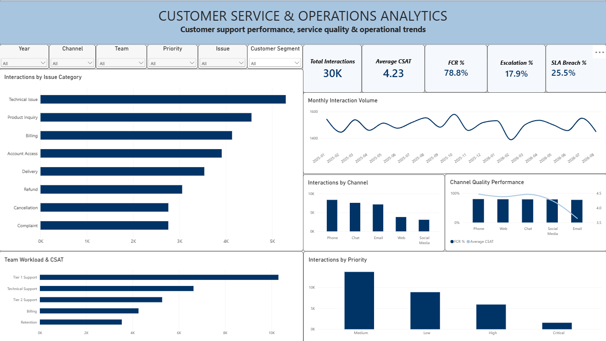
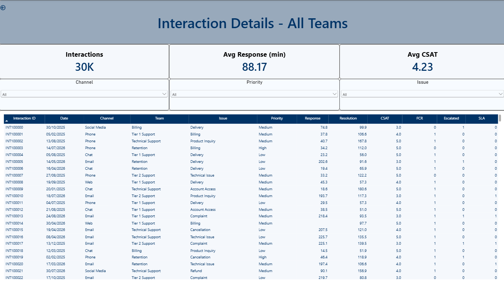

# Customer Service Quality Analysis Dashboard

An end-to-end **Customer Service & Operations Analytics** project built to analyze customer-service interactions, monitor service-quality KPIs, evaluate channel and team performance, identify operational bottlenecks, and support root-cause analysis.

The project combines **Python, PostgreSQL/SQL, and Power BI** to demonstrate a practical data-analysis and business-reporting workflow.

> **Current analysis:** 30,000 synthetic customer-service interactions covering January 2025–August 2026. The dataset is for portfolio/educational use and contains no real customer or company data.

## Dashboard Screenshots

### Executive Overview



### Interaction Details



## Dashboard

The Power BI report includes:

- Executive Overview
- KPI cards for interactions, CSAT, FCR, escalation, and SLA breach
- Monthly interaction trends
- Channel performance
- Issue-category analysis
- Channel quality analysis
- Team workload and CSAT
- Priority analysis
- Interactive slicers
- Drill-through Interaction Details page
- Dynamic drill-through title
- Interaction-level records

## Key KPIs

| KPI | Value |
|---|---:|
| Total Interactions | **30,000** |
| Average CSAT | **4.23 / 5** |
| FCR | **78.8%** |
| Escalation Rate | **17.9%** |
| SLA Breach Rate | **25.5%** |
| Average Response Time | **88.2 min** |
| Average Resolution Time | **107.0 min** |

## Business Insights

The analysis identified several operational patterns:

- **Email** represented 23.9% of interactions but approximately **67.1% of all SLA breaches**, with a 71.6% SLA-breach rate and 212.3-minute average response time.
- **Critical and High-priority cases** showed lower FCR and higher escalation/SLA-breach rates than Low-priority cases.
- **Technical Issues** were the largest issue category at 17.6% of interactions and had a 72.4% FCR, approximately 6.4 percentage points below the overall FCR.
- **Technical Support** had the longest average resolution time at approximately 159 minutes and the lowest team-level CSAT at 4.15.
- Response time showed a **-0.487 correlation with CSAT** and a **+0.647 correlation with SLA breaches**.

See the complete analysis in **[BUSINESS_INSIGHTS.md](BUSINESS_INSIGHTS.md)**.

> Correlation findings describe association, not causation. The dataset is synthetic and the observations should be validated with real operational data.

## Technology Stack

| Technology | Purpose |
|---|---|
| **Python** | Data cleaning, validation, EDA and KPI analysis |
| **Pandas / NumPy** | Data manipulation and analysis |
| **PostgreSQL** | Data storage and analytical querying |
| **SQL** | KPI calculations, aggregation, CTEs and window functions |
| **Power BI** | Interactive dashboard and reporting |
| **DAX** | KPI measures, date table and drill-through logic |
| **Git / GitHub** | Version control and project documentation |

## Analysis Workflow

```text
Customer-Service Data
        ↓
Python Data Validation & Cleaning
        ↓
PostgreSQL
        ↓
SQL KPI & Performance Analysis
        ↓
Power BI Data Model & DAX
        ↓
Interactive Executive Dashboard
        ↓
Drill-through Interaction Details
        ↓
Business Insights
```

## SQL Analysis

The SQL layer covers:

1. Overall KPI calculation
2. Channel performance
3. Issue-category analysis
4. Team performance
5. Monthly trends
6. Priority analysis
7. Customer-segment analysis
8. Agent performance
9. High-risk interactions
10. Team-vs-overall comparisons using CTEs
11. Rolling 3-month CSAT using window functions

## Power BI Model

The report uses a dedicated `DateTable` related to `customer_interactions[Interaction_date]`.

### Core DAX Measures

```DAX
Total Interactions =
COUNTROWS(customer_interactions)

Average CSAT =
AVERAGE(customer_interactions[csat])

FCR % =
AVERAGE(customer_interactions[fcr])

Escalation % =
AVERAGE(customer_interactions[escalated])

SLA Breach % =
AVERAGE(customer_interactions[sla_breached])

Avg Response Time =
AVERAGE(customer_interactions[response_time_min])

Avg Resolution Time =
AVERAGE(customer_interactions[resolution_time_min])
```

## Project Structure

```text
Customer-Service-Quality-Dashboard/
├── data/
│   ├── customer_service_interactions.csv
│   ├── customer_service_data_dictionary.csv
│   └── processed/
│       └── customer_service_cleaned.csv
├── notebooks/
│   └── 01_eda_cleaning.ipynb
├── sql/
│   └── analysis_queries.sql
├── src/
│   └── data_cleaning.py
├── powerbi/
│   └── Customer_Service_Quality_Dashboard.pbix
├── screenshots/
│   ├── executive_overview.png
│   └── interaction_details.png
├── BUSINESS_INSIGHTS.md
├── requirements.txt
├── .gitignore
└── README.md
```

## Skills Demonstrated

- Data Cleaning & Validation
- Exploratory Data Analysis
- Python / Pandas / NumPy
- PostgreSQL
- Analytical SQL
- CTEs
- Window Functions
- KPI Development
- Customer Service Analytics
- Power BI
- DAX
- Data Modeling
- Interactive Dashboard Development
- Drill-through Analysis
- Business Insight Generation

## Resume Version

**Customer Service & Operations Analytics Dashboard | Python, SQL, PostgreSQL, Power BI, DAX**

- Analyzed **30,000 customer-service interactions** across channels, teams, issue categories, priorities, and customer segments to evaluate CSAT, FCR, escalation, SLA, response time, and resolution performance.
- Used **Python and PostgreSQL/SQL** for data cleaning, validation, KPI computation, segmentation, trend analysis, CTEs, and window-function analysis.
- Built an interactive **Power BI dashboard** with KPI cards, time trends, channel and issue analysis, team workload, priority analysis, slicers, and drill-through interaction details.
- Identified **Email as a major SLA bottleneck**, accounting for approximately **67% of all SLA breaches** while representing 23.9% of interactions.
- Found a **-0.49 correlation between response time and CSAT** and a **+0.65 correlation between response time and SLA breaches**, supporting further investigation of response-time management.

## Author

**Abdul Momin Siddiqui**

B.Tech — Electronics & Communication Engineering  
Indian Institute of Information Technology, Ranchi

- GitHub: **SIDMINUL**

## Disclaimer

This project uses a **synthetic dataset** for educational and portfolio purposes. The findings should not be interpreted as real customer, employee, or company performance data.
